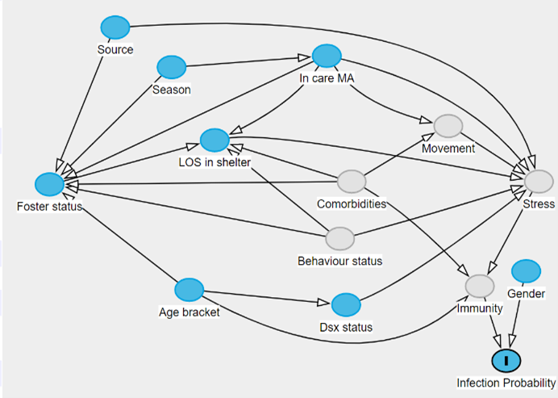

# Risk Factor Analysis for Feline Upper Respiratory Tract Infections in RSPCA shelters across Queensland

Authors:
Dr. Uttara Kennedya, Dr. Mandy Patersonb, Dr. Nicholas Clarkc

Affiliations:
UQ School of Veterinary Science, The University of Queensland, Gatton, Queensland 4343, Australiaa,b,c
RSPCA Queensland, Animal Care Campus, 139 Wacol Station Road, Wacol, Queensland 4076, Australiaa,b

Corresponding author:
Dr. Uttara Kennedy (BVSc, MSc, MANZCVS)
UQ School of Veterinary Science, The University of Queensland, Gatton, Queensland 4343, Australia | uttara.kennedy@uq.edu.au | +61 424 094 789

Acknowledgements: 
RSPCA Queensland
 
## Research Summary:
The aims of this paper are to (1) provide an understanding of the demographic and temporal attributes of potential risk factors for feline URT infection across RSPCA Qld shelters, (2) create a detailed causal framework to demonstrate presumed relationships of potential risk factors with each other and with infection probability and (3) use multiple models to quantify causal effects of admission variables (source, gender, age), number of animals in care, length of stay, time spent in foster and season on risk of feline URT infection. 
We used retrospective clinical records from RSPCA Qld for this research. Records of all felines entering the charity’s shelters between the periods of 1-January 2013 and 31-December 2020 were obtained. Each animal’s record contained a (1) unique animal identification number, (2) demographic details such as age (as estimated at the time of entry into the shelter), neuter status on entry and gender, (3) incoming circumstance, date and region, (4) length of stay, (5) days spent in foster, (6) date and status of final outcome for that animal and (7) free-text veterinary clinical notes. 

Figure 1 demonstrates the causal relationships between exposure variables and the outcome of interest. Observed and measurable exposure variables (animal’s source, neuter status on entry into the shelter (Dsx status), seasonal changes, housing density or the total number of animals in care (defined as a moving average to capture an individual’s average environment), whether an animal was sent out to foster, and total length of time that an animal spent in the shelter excluding time spent in foster (LOS in shelter) as well as unobserved variables (presence of comorbidities, behavioral predisposition and number of times an animal was moved between/within shelters) were added to the DAG and connected through appropriate causal pathways.

#### Figure 1: Direct Acyclic Graph showing postulated causal relationships between exposure variables and outcome (infection probability). Light grey variables are unobserved

Using the DAG, we defined four models where each exposure variable was verified sequentially and presumed to exert influence on the outcome independently. The final adjusted models took the following form:

### Infection Probability by Gender:
logit(π)= α+ α_source + β_gender*gender+ β_los*los + β_fostered*fostered + β_age*age_bracket + β_dsx*dsx_status+ 
 f(incare) + f(month)

### Infection Probability by Desex status, Source and In-care count:
logit(π)= α+ α_source + β_gender*gender+  β_age*age_bracket + 
β_dsx*dsx_status+  f(incare) + f(month)

### Infection Probability by Age bracket:
logit(π)= α+ α_source + β_gender*gender+  β_age*age_bracket + 
f(incare) + f(month)

### Infection Probability by Season:
logit(π)= α+ α_source + β_gender*gender+  β_age*age_bracket +
 β_dsx*dsx_status+ f(month)

Where:

f(month)= ∑▒〖β_month*b_month 〗 
β_month  ~ Normal(μ_month,σ_month) 
f(incare)= ∑▒〖β_incare*b_incare 〗 
β_incare  ~ Normal(μ_incare,σ_incare) 
α_source=Normal(μ_source,σ_source)
When the effect of an animal’s gender and its desex status were adjusted using minimum adjustment sets, our models estimated that males were 1.24 (95% CI 1.19, 1.31) times more likely than females to be infected, while already desexed animals were only 0.68 (95% CI 0.60, 0.72) as likely to be infected compared to those not desexed on entry into the shelter. Similarly, cats (> 4 months) were twice as likely (95% CI 1.91, 2.09) as kittens (0-4 months) to be infected. After controlling for source-level variables using random effects, animals entering the shelter as seized by the inspectorate (n = 415) were estimated to have the highest probability of infection compared to animals from other sources (Table 1).
Table 1: Adjusted OR for various animal sources
Source	Adjusted OR	95% CI
Seized (n=415)	0.51	0.46-0.57
Stray (n=27,513)	0.34	0.32-0.36
Surrendered (n=9,438)	0.26	0.24-0.28

Figures 2a-f display conditional adjusted predictions of infection probability of animals in relation to various predictors (month of entry, animal source, age, gender, desex status and housing density). Model predictions demonstrated that infection probability was highest in winter months for seized animals, adults, males and animals not desexed on entry. Infection probability also increased with a higher number of animals already in the shelter. The model’s output was tested by computing predictions using new data with specified values for chosen predictors, holding all other predictors at their mean/mode. Figure 3 compares the difference in model predictions between May and December, for two hypothetical housing densities: low (n = 666) versus high (n = 1212). 

	

	
